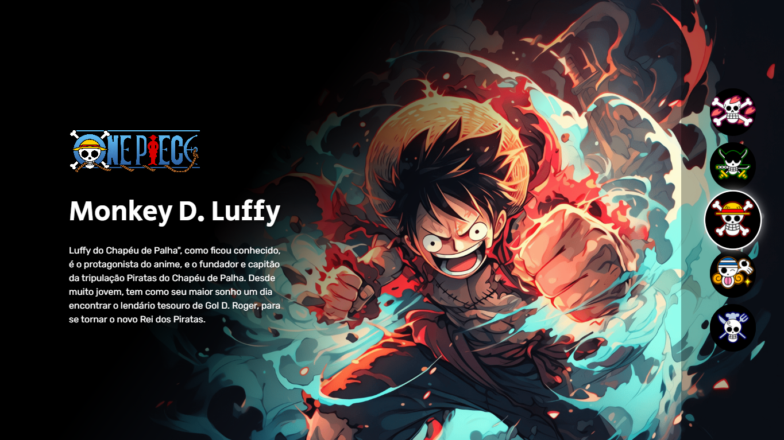

# One Piece - Personagens Interativos

Este projeto é uma página web interativa que apresenta os principais personagens do anime One Piece, desenvolvida durante a "Semana do Zero ao Programador Contratado" Evento Dev em Dobro.



## 📋 Descrição

Uma aplicação web responsiva que permite aos usuários navegar entre diferentes personagens de One Piece, exibindo informações e imagens de cada um. O projeto demonstra técnicas modernas de desenvolvimento front-end com foco em acessibilidade e experiência do usuário.

## ✨ Funcionalidades

- **Seleção Interativa de Personagens**: Navegação por clique ou teclado
- **Design Responsivo**: Adaptado para diferentes tamanhos de tela
- **Persistência de Dados**: Lembra a última seleção do usuário
- **Efeitos Visuais**: Transições suaves e efeitos de foco
- **Acessibilidade**: Navegação por teclado e atributos ARIA
- **Sons Interativos**: Feedback auditivo ao interagir (se implementado)

## 🛠️ Tecnologias Utilizadas

- **HTML5**: Estrutura semântica
- **CSS3**: Estilização com Flexbox, Gradientes e Media Queries
- **JavaScript**: Interatividade e manipulação do DOM
- **Google Fonts**: Tipografia (Rubik e Secular One)

## 🎨 Estrutura de Arquivos

```
projeto/
├── index.html          # Estrutura principal
├── src/
│   ├── css/
│   │   ├── reset.css   # Reset de estilos
│   │   ├── estilos.css # Estilos principais
│   │   └── responsivo.css # Media queries
│   ├── js/
│   │   └── index.js    # Lógica de interação
│   └── imagens/        # Assets visuais
└── README.md
```

## 🚀 Como Executar

1. Clone ou baixe os arquivos do projeto
2. Abra o arquivo `index.html` em qualquer navegador moderno
3. Navegue pelos personagens clicando nos ícones ou usando as setas do teclado

## 📱 Responsividade

O projeto é totalmente responsivo e se adapta a:

- Desktops (acima de 1024px)
- Tablets (768px - 1024px)
- Smartphones (480px - 768px)
- Dispositivos móveis pequenos (abaixo de 480px)

## ♿ Acessibilidade

- Navegação por teclado (setas para cima/baixo)
- Atributos `aria-label` descritivos
- Foco visual nos elementos interativos
- Contraste adequado para leitura

## 🎯 Personagens Incluídos

- Monkey D. Luffy (padrão)
- Tony Chopper
- Roronoa Zoro
- Nami
- Sanji

## 🔧 Personalização

Para adicionar novos personagens:

1. Adicione a estrutura HTML no container `.personagens`
2. Inclua o botão correspondente na lista `.botoes`
3. Adicione as imagens na pasta `src/imagens/`

## 📝 Próximas Melhorias Possíveis

- Adição de mais personagens da tripulação
- Implementação de efeitos sonoros
- Animações CSS mais elaboradas
- Modo escuro/claro
- Integração com API de One Piece

## 📄 Licença

Este projeto foi desenvolvido para fins educacionais durante a "Semana do Zero ao Programador Contratado".

---

**Desenvolvido com ❤️ para os fãs de One Piece**